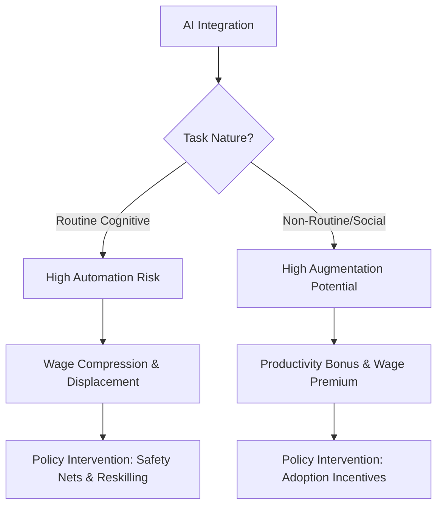

# 📄 Policy Proposal: The "Human-Plus" Strategy
To: Deputy Secretary, Higher Education and Workforce, DJSIR

From: Policy Analyst, Future of Work Taskforce

Subject: 🚀 Securing Victoria’s Labour Advantage in the Age of AI

# 📑 Executive Summary
Victoria is undergoing a major transformation in its industrial landscape as generative AI and algorithmic management increasingly reshape the local economy. Confronted with a “Double Disruption” driven by post-pandemic recovery and the rapid automation of cognitive tasks, this proposal argues against defensive job protection measures. Instead, it supports a proactive **“Human-Plus”** strategy.
With 45% of Victorian work hours expected to be affected by AI by 2026 (VSA 2025), immediate and strategic action is critical. This brief presents a policy package aimed at preventing wage inequality and the decline of entry-level employment opportunities. It recommends a three-part approach: **AI-Vantage Vouchers**, the **AI-Humanity Accord**, and **Algorithmic Transparency Standards**. Together, these initiatives are projected to increase Victoria’s Gross State Product by approximately 3.5% by 2030, while ensuring the “ladder of opportunity” remains accessible for junior and transitional workers.

# 1. 🔍 Problem Definition & Context
The current economic landscape is defined by **Task-Biased Technological Change (TBTC)**. Unlike previous waves of automation that replaced manual "brawn" with mechanical "cables," AI replaces or augments cognitive "brain" tasks. The core problem for Victorian policymakers is that AI does not eliminate entire occupations; rather, it unbundles them into discrete tasks (Acemoglu & Restrepo 2019).

In the Victorian context, this “unbundling” creates three main policy tensions:
1.	The Entry-Level Gap: Junior roles in accounting, law, and administration, long used as the “apprenticeship” stage for Victorian graduates, are being automated at the task level, creating a gap in professional learning and career development.
2.	Productivity Divergence: Large enterprises in the Docklands are successfully adopting proprietary AI, while family-owned SMEs across suburban Melbourne risk falling behind because of high setup costs and limited technical expertise.
3.	Labour Market Friction: The pace of AI adoption is faster than the current retraining capacity of the VET (Vocational Education and Training) sector, which may lead to structural unemployment even while demand remains high in tech-adjacent roles.

# 2. 📊 Analysis of Impacts: A Distributional & Equity Lens
## 🏙️ Employment and Task Shifting
The impact of AI on employment is uneven across industries and occupations. According to the Victorian Skills Plan 2025–2026, demand for digitally skilled workers is expected to rise by 12% each year, while traditional clerical roles are projected to decline by 8% (VSA 2025). This does not point to a “jobless future,” but rather to a “reallocated future.”
In Melbourne’s professional services sector, AI now completes around 70% of early-stage document discovery and data reconciliation tasks. While this allows senior professionals to focus more on strategic work, it also weakens the traditional junior clerk pathway. For a city that promotes itself as a “Knowledge Capital,” this disrupts the generational transfer of workplace skills and experience.
## 💰 Wages and Economic Polarisation
Economic theory suggests that AI may intensify wage polarisation (Autor 2022). Highly skilled “superstar” workers who can use AI to improve productivity are likely to receive strong wage benefits. In contrast, workers performing easily automated tasks may experience wage pressure as they shift into sectors such as aged care, hospitality, and construction, where productivity and wage growth are generally slower.
## ⚖️ Distributional Equity: Gender and Regional Divide
A distributional perspective shows that women are overrepresented in administrative and mid-level managerial roles that are most exposed to routine cognitive automation. At the same time, regional centres such as Geelong and Bendigo face different challenges from Melbourne’s CBD. While metropolitan areas experience “high-tech friction,” regional Victoria faces an “adoption lag,” where limited AI-ready infrastructure reduces business competitiveness and growth opportunities.
## 🏭 Industrial Structure: SMEs vs. “Big Tech”
Victoria’s economy is heavily supported by SMEs. Large corporations can invest in customised AI systems that improve supply chains and workforce management. Without government support, the productivity gap between small family-owned businesses and AI-enabled franchises will continue to widen, increasing market concentration and reducing local entrepreneurial diversity.

# 3. 🛠️ Policy Options: Evaluation and Criteria
To respond to these challenges, three policy interventions are assessed using the criteria of economic efficiency, equity, and administrative feasibility.

## Option 1: The “AI-Vantage” Reskilling Voucher System
**Mechanism:** A government-funded credit of $2,500 for Victorian workers in high-risk sectors such as retail, administration, and manufacturing to complete accredited AI-literacy micro-credentials through Victorian TAFEs or universities.
* Evaluation:
   * Efficiency: High. Directly addresses the skills needed for AI augmentation.
   * Equity: High. Reduces financial barriers for low-income and displaced workers.
   * Feasibility: Builds on existing VET infrastructure but requires rapid curriculum updates.

## Option 2: The “AI-Humanity Accord” (Certification & Tax Credit)
**Mechanism:** A voluntary certification program for Victorian businesses that adopt “Socially Responsible AI.” Certified firms receive a 5% payroll tax offset if they demonstrate that AI-related savings were used to upskill employees rather than reducing staff numbers.
* Evaluation:
   * Efficiency: Moderate. Reduces immediate displacement but may create “deadweight loss” by subsidising firms that would have invested in training regardless.
   * Equity: Very High. Encourages businesses to maintain social responsibility.
   * Feasibility: Moderate. Requires strong auditing systems to prevent “AI-washing.”

## Option 3: Algorithmic Management & Labour Rights Standards
**Mechanism:** Amendments to the Fair Work (Victoria) Act, or similar state-level guidance, requiring transparency in automated rostering and “human-in-the-loop” oversight for hiring and dismissal decisions (OECD 2023).
* Evaluation:
   * Efficiency: Low in the short term, as compliance costs for businesses may increase.
   * Equity: Very High. Protects gig and part-time workers from “management by algorithm” (Kellogg, Valentine & Christin 2020).
   * Feasibility: High. Expands on Victoria’s existing industrial relations framework.

 

# 4. 💡 Recommendation & Implementation Plan
The Recommended Package: The “Human-Plus” Hybrid
The preferred approach is a hybrid package combining Option 1 (Vouchers) and Option 3 (Regulatory Standards), supported by a pilot of Option 2 (The Accord) within Melbourne and Dandenong industrial zones.

## 📅 Implementation Timeline
**Phase 1:** Foundation (Q3 2026 – Q4 2026)
* Establish the Victorian AI Labour Monitor to track workforce displacement using Single Touch Payroll data.
* Develop Algorithmic Transparency Guidelines for the Victorian Public Service as a lead-by-example initiative.

**Phase 2:** Execution (Q1 2027 – Q4 2027)
* Distribute 15,000 AI-Vantage vouchers to workers aged 25–45 employed in high-risk administrative roles.
* Launch the AI-Humanity Accord pilot with 100 SME partners in hospitality and retail.

**Phase 3:** Evaluation & Expansion (2028 onwards)
* Assess impacts on wages and job-transition outcomes.
* Support “Augmentation Startups” in Cremorne to build AI tools tailored to Victorian industry needs.

### 💰 Estimated Costs and KPIs
* Funding: $45 million over two years, funded through a realignment of the Digital Jobs program.
* KPI 1: 85% of voucher recipients remain employed or transition into higher-paying roles within six months.
* KPI 2: Full compliance with algorithmic transparency standards across Victorian gig-economy platforms.

# ⚠️ Risks & Mitigation Strategies
* **Risk:** Technological Lag – Voucher course content may become outdated before completion.
   * *Mitigation:* Introduce industry-led micro-credentials updated every six months in partnership with leading technology organisations.
* **Risk:** Capital Flight. Strict AI regulations may drive technology firms to relocate.
   * *Mitigation:* Align Victorian standards with emerging Federal and International (EU AI Act) frameworks to ensure consistency.

# 📚 6. References
* Acemoglu, D & Restrepo, P 2019, ‘Automation and New Tasks: How Technology Displaces and Reinstates Labor’, Journal of Economic Perspectives, vol. 33, no. 2, pp. 3–30.
* Autor, David. (2022). The Labor Market Impacts of Technological Change: From Unbridled Enthusiasm to Qualified Optimism to Vast Uncertainty. SSRN Electronic Journal. doi: https://doi.org/10.2139/ssrn.4122803 
* Department of Jobs, Skills, Industry and Regions (DJSIR) 2026, Victoria’s 2026 AI Economic Outlook, Victorian Government, Melbourne.
* Kellogg, KC, Valentine, MA & Christin, A 2020, ‘Algorithms at Work: The New Contested Terrain of Control’, Academy of Management Annals, vol. 14, no. 1, pp. 366–410.
* OECD (2023), OECD Employment Outlook 2023: Artificial Intelligence and the Labour Market, OECD Publishing, Paris, doi: https://doi.org/10.1787/08785bba-en. 
* Victorian Skills Authority (VSA) 2025, Victorian Skills Plan for 2025 into 2026, Victorian Government, Melbourne.
